<div align="center">
  
  <h1>Echo Insight</h1>
  <p><strong>See project health, risks, and next steps across your Feishu workspace.</strong></p>
  <p>A read-only project risk observability tool: the server normalizes authorized facts, deterministic rules calculate health and risk, and AI explains impact and suggests actions.</p>

  <p>
    <a href="./README.md">简体中文</a> ·
    <a href="./README.en.md">English</a>
  </p>

  <p>
    <a href="./LICENSE"></a>
    <a href="./LICENSE-DOCS.md"></a>
    
  </p>

  <p>
    <a href="https://echo-insight.pages.dev/?mode=demo"><strong>Online product experience</strong></a> ·
    <a href="./README.en.md#two-ways-to-use-echo-insight">Usage paths</a> ·
    <a href="./README.en.md#product-screenshots">Screenshots</a> ·
    <a href="./README.en.md#one-command-local-setup">One-command setup</a> ·
    <a href="./README.en.md#installation-guide">Self-hosting</a>
  </p>
</div>

---

## What is Echo Insight?

Critical project information is often scattered across Base tables, chats, meeting minutes, documents, tasks, and calendars. Echo Insight turns Feishu data that a user has explicitly authorized and can actually access into a unified project context. It helps project owners and team members answer three questions quickly:

1. Is the project healthy right now?
2. Which risks deserve attention first?
3. What evidence supports each finding, and what could the team do next?

Echo Insight is not an agent that automatically operates your projects. It does not change tasks, owners, deadlines, or documents. It is a project radar: confirmed facts, unconfirmed signals, and source conflicts remain visibly separate so that people make the final decision from evidence.

## Two ways to use Echo Insight

| Path | Best for | Entry point | What you need |
| --- | --- | --- | --- |
| **Online product experience** | Users who want to understand the complete product first | [Open Echo Insight](https://echo-insight.pages.dev/?mode=demo) | Choose the full demo or Feishu sign-in first; the demo needs no login or API key |
| **Self-hosted deployment** | Teams or developers who want control over data, models, and runtime | [Start with the installation guide](./README.en.md#installation-guide) | Node.js, a Feishu custom app, your own AI Provider API key, HTTPS, and persistent storage |

### Online product experience guide

1. Open the [Echo Insight online product experience](https://echo-insight.pages.dev/?mode=demo), then choose **Enter the complete demo account** or **Sign in with Feishu and use my projects**.
2. Switch among five synthetic projects with different health levels, then explore the project overview, Risk Center, AI Report, all seven source types, cross-project AI Insights, and Settings. Production deterministic rules calculate health and risk in real time; AI explanations are pre-generated examples, so the page never calls an external model.
3. Only when you want to see your own projects, choose **Sign in and use my projects** and complete Feishu authorization.
4. On first entry to the real workspace, connect your own DeepSeek or Qwen key, or skip AI and keep deterministic health and risk rules only.
5. A new account with no project memberships sees an empty real workspace, never a maintainer's or another user's project. You can return to the complete no-login demo account at any time.

> **The no-login demo account reads no Feishu data and consumes no one's model quota.** In the real workspace, the online deployment still never falls back to a maintainer-owned model key for visitors. Your key is encrypted on the server and bound to your account within the same Echo Insight deployment and Feishu app. It is never written to browser storage, project files, or the repository, and the status API never returns it. The same account is restored after sign-out and sign-in, session expiry followed by sign-in, another device, or a backend restart followed by sign-in; different accounts remain isolated. Only **Disconnect and delete saved API key** removes Echo Insight's saved record. Without a connected model, deterministic health and risk rules remain available while AI explanations and synthesis are unavailable.

DeepSeek or Qwen bills the account that owns the key; Echo Insight does not collect those model fees. **Connect and verify** makes one tiny connectivity request. Once connected, entering a configured project, opening AI Insights for the first time, or manually refreshing may automatically call the model. The online version limits each Feishu-app account to 12 AI explanation / synthesis tasks per 10 minutes with at most two concurrent tasks, and three connection checks; signing in again or changing devices does not reset the in-process account limit. Provider retries and the final bill remain governed by the model platform. The online entry is intended for learning the product flow. For long-running, detailed, or sensitive project data, follow the [self-hosting guide](./README.en.md#installation-guide) and set budget or usage alerts at your model provider.

The demo account and real workspace are isolated data domains. The demo needs no login and its server rejects every write operation. The real workspace requires Feishu sign-in, but not every tenant or account is automatically eligible; visible real content always depends on the app's availability scope, user authorization, and project permissions.

## Product screenshots


<table>
  <tr>
    <td width="50%" valign="top">
      <strong>Cross-project AI Insights</strong><br />
      <sub>Aggregate risks already confirmed by rules before explaining priority and actions.</sub><br /><br />
      
    </td>
    <td width="50%" valign="top">
      <strong>Project AI Report</strong><br />
      <sub>Keep risk facts, rule evidence, AI explanations, and next steps distinct.</sub><br /><br />
      
    </td>
  </tr>
  <tr>
    <td colspan="2" valign="top">
      <strong>Explicit data-source configuration</strong><br />
      <sub>Read only the resources an owner explicitly selects or pastes; never discover project content automatically.</sub><br /><br />
      
    </td>
  </tr>
</table>

> Every screenshot uses synthetic demo data. No screenshot represents a real Feishu tenant, member, or project.

## Core capabilities

| Capability | Product behavior |
| --- | --- |
| **Multi-project dashboard** | Summarizes health, risk counts, priority items, and favorite projects the user can access |
| **Seven Feishu source types** | Supports Base, Chat, Minutes, Docs, Wiki/Drive, Task, and Calendar |
| **Deterministic risk rules** | Calculates health, severity, and matched reasons from structured facts before any model is used |
| **Layered project information** | Separates confirmed facts, unconfirmed signals, source conflicts, and freshness; unconfirmed information does not enter formal risk calculations |
| **AI explanations and suggestions** | Explains rule results, impact, priority, and possible actions; confirmed rule results remain available when the model fails |
| **Cross-project insights** | Aggregates confirmed risks across projects, supports severity and project filters, and sorts by risk priority or planned time |
| **Permission and role boundaries** | Performs login, resource authorization, and field filtering on the server; owners manage sources while members view status |
| **Bring your own model** | The online version supports account-scoped official DeepSeek and Qwen presets with server-side encryption; self-hosting also supports custom OpenAI-compatible Chat Completions providers |

## How it works

```mermaid
flowchart LR
    A[Open the online entry] --> B{Choose an experience}
    B -- Full demo --> C[Complete no-login demo account]
    B -- Sign in --> E[Feishu login]
    C --> D{View my real projects?}
    D -- No --> C
    D -- Yes --> E
    E --> F[Create a project / join after permission verification]
    F --> G[Owner explicitly selects data sources]
    G --> H[Identity and permission filtering]
    H --> I[Multi-source normalization and aggregation]
    I --> J[Confirmed facts]
    I --> K[Unconfirmed signals / source conflicts]
    J --> L[Deterministic health and risk rules]
    L --> M[Health / risk facts / rule evidence]
    M --> N[Optional AI explanations and suggested actions]
    K --> O[Displayed separately; excluded from formal scoring]
    N --> P[Project workspace and cross-project insights]
    O --> P
    P --> Q[Human decision]
```



The pipeline keeps four invariants: permission filtering precedes analysis; deterministic rules precede AI; AI cannot change facts or scores; and an external-model failure is never disguised as success.

<a id="installation-guide"></a>

## Installation Guide

If this is your first time installing a project from GitHub, choose your goal first, then follow the four steps below. Do not download just one `setup-local` file: the three root entry points depend on engineering scripts and locked dependencies elsewhere in the repository, so the complete directory structure must remain intact.

| Your goal | Feishu login | Public HTTPS | Recommended entry |
| --- | --- | --- | --- |
| Explore the product | No | No | [Complete demo account](https://echo-insight.pages.dev/?mode=demo) |
| Run synthetic projects on your computer | No | No | [Local Demo](./README.en.md#local-demo-no-real-feishu) |
| Read your own real Feishu projects | Yes | Yes | Obtain a stable HTTPS address first (tunnel or public deployment), then run root `setup-local.*` |

> **Only real Feishu integration needs a public address.** Echo Insight's currently supported real OAuth / production setup requires a stable HTTPS frontend origin that the user's browser can reach, in the form `https://echo.<your-real-domain>` (a placeholder format, not a value to paste literally). Setup derives the callback from it, but does not buy a domain, create an HTTPS tunnel, or deploy cloud infrastructure. To keep the supported security topology narrow, setup rejects `localhost`, private-network addresses, and reserved domains. The Local Demo has no such requirement.

### 1. Download the complete project

Beginners should use [Download the complete project ZIP](https://github.com/xixi01010/Echo-Insight/archive/refs/heads/main.zip), or choose **Code → Download ZIP** on the GitHub repository page. Extract all files before continuing; do not run the script from inside the ZIP preview.

If you already use Git, you can instead run:

```bash
git clone https://github.com/xixi01010/Echo-Insight.git
```

### 2. Find the outermost repository root and entry point

After extraction, open the outermost `Echo-Insight-main` folder. The correct location contains `README.md`, `02_工程代码`, and all three entry-point files below. If you see only `package.json`, `frontend`, and `backend`, you have gone one level too deep; return to the parent folder.

| System | Root entry point | Recommended action |
| --- | --- | --- |
| Windows | `setup-local.cmd` | Open a terminal in the root and run `./setup-local.cmd` |
| Windows PowerShell | `setup-local.ps1` | Open PowerShell in the root and run `./setup-local.ps1` |
| macOS / Linux | `setup-local.sh` | Open a terminal in the root and run `sh ./setup-local.sh` |

**Windows:** On Windows 11, right-click an empty area of the folder and choose **Open in Terminal**. On other Windows versions, click the folder address bar, type `powershell`, and press Enter. You can also double-click `setup-local.cmd`, but its window may close immediately after success or failure, so launching it from a terminal is recommended.


**macOS:** Double-click the ZIP in Finder's Downloads folder to extract it, then open Terminal. Type `cd ` with a trailing space, drag `Echo-Insight-main` from Finder into Terminal, and press Return. Run `pwd` and `ls README.md setup-local.sh "02_工程代码"` to confirm the root, then run `sh ./setup-local.sh`. Do not double-click the `.sh` file: hidden App Secret and API-key prompts require an interactive terminal. Some macOS versions expose **New Terminal at Folder** under Finder Services; its wording varies by language and release.


The diagram keeps the Chinese labels used by the Chinese README; the terminal commands in the English steps above are authoritative. It is an operating diagram, not a macOS-device screenshot.

### 3. Complete the guided Feishu configuration

Provide the App ID, hidden App Secret, final public HTTPS origin, and absolute runtime directory shown by the prompts. Setup then prints the exact callback and the permission checklist for all seven source types. Complete those steps in the Feishu developer console before returning to the terminal to confirm them.


### 4. Choose a model service and finish local configuration

Choose a Provider and enter your own API key through the hidden prompt. Feishu credential verification and the AI connectivity check are disabled by default; a real network request is made only when you explicitly opt in. After setup reports completion, continue with the [one-command setup details](./README.en.md#one-command-local-setup) and [complete self-hosting](./README.en.md#complete-self-hosting) sections to finish administrator approval, app release and installation, resource grants, HTTPS deployment, and real-browser acceptance.


> The three PNGs come from a Windows isolated rehearsal performed on 2026-09-05 with sample credentials. It did not read the project's real `.env` or call the Feishu credential or AI model endpoints. The macOS image is an operating diagram for the same command, not a macOS-device screenshot. `setup-local.sh` has passed static compatibility checks, but full macOS support is not claimed until a real-device rehearsal is complete.

## One-command local setup

The repository root includes entry points for Windows, PowerShell, and macOS / Linux. Here, "local" means the setup tool runs on your computer; it does not mean real Feishu integration works on `localhost` alone. These entry points install locked dependencies and guide you through server-side Feishu app, OAuth callback, runtime-directory, and AI Provider configuration.

### Requirements

- [Node.js](https://nodejs.org/en/download/) `^20.19.0` or `>=22.12.0`, including npm
- Git, only if you choose `git clone`; downloading the ZIP does not require it
- A Feishu custom app and its App ID and App Secret
- The final, publicly reachable HTTPS frontend origin, in the form `https://echo.<your-real-domain>` (replace the placeholder before entering it)
- Your own AI Provider API key; the corresponding platform bills model usage

### 1. Get the source

```bash
git clone https://github.com/xixi01010/Echo-Insight.git
cd Echo-Insight
```

### 2. Run a setup entry point from the repository root

Windows (running it from a root-directory terminal is recommended; you may also double-click `setup-local.cmd`):

```powershell
.\setup-local.cmd
```

Windows PowerShell:

```powershell
.\setup-local.ps1
```

macOS / Linux:

```sh
sh ./setup-local.sh
```

On macOS, verify the current folder first if needed:

```sh
pwd
ls README.md setup-local.sh "02_工程代码"
```

The setup tool will:

- validate the Node.js version;
- install locked dependencies with `npm ci`;
- check the default ports `3000` and `5173`;
- collect the App ID, hide the App Secret while typing, and derive the exact OAuth callback from the final HTTPS origin;
- require an absolute persistent-runtime path;
- show the permissions and resource-visibility checklist for all seven source types, then wait for confirmation that the Feishu-console steps are complete;
- configure DeepSeek, Qwen, or a custom OpenAI-compatible Provider while hiding the API key;
- generate a non-displayed visitor-AI master key so an account-scoped BYOK mode can be enabled safely later;
- create the server-side `.env` exclusively, and only when no such file exists at the engineering root;
- skip real network requests by default; only with separate approval will it verify Feishu credentials or make one potentially billable model request.

The setup tool will not:

- read or overwrite an existing `.env`; if one exists, it stops before installing dependencies;
- create, publish, or install a Feishu app, approve permissions, or set its availability scope;
- add the bot to a target chat, grant the app access to a target Base, or grant a user access to a specific resource;
- create a public HTTPS origin or prove that Feishu can reach it;
- choose in-product project sources for you;
- start the frontend or backend automatically;
- create Cloudflare, Railway, Docker, or other cloud resources.

Treat this entry point as **one-command installation with complete configuration guidance**, not one-click cloud deployment. External-platform work and real-browser acceptance are still required.

### Local Demo (no real Feishu)

To run the promo-video fixtures on your own computer, you do not need an App ID, App Secret, public URL, or model API key, and should not run `setup-local.*` first. After installing Node.js, run from the repository root:

```sh
cd "02_工程代码"
npm ci
```

Then open two terminals in `02_工程代码`. In terminal A:

```sh
npm run demo:backend
```

In terminal B:

```sh
npm run dev:frontend
```

Open `http://localhost:5173`. This mode uses a dedicated synthetic dataset and pre-generated demo explanations. It does not sign in to Feishu or call a real model. Closing either terminal or shutting down the computer stops the service. Use it for product exploration and development, never for real project data.

### Where does the product run after setup?

Echo Insight is a browser frontend plus a Node.js backend, not a local desktop application hosted by Feishu. Feishu supplies identity authorization and data APIs; you still run the frontend, backend, and runtime storage. Whether cloud hosting is required depends on your goal:

| Runtime | Who can access it | Real Feishu OAuth | Availability |
| --- | --- | --- | --- |
| `localhost` Local Demo / development | A browser on the same computer | Disabled by the normal development mode | While both terminals are running |
| Local services plus a stable HTTPS tunnel | Test users who have the link and are inside the app availability scope | Configurable with the current same-origin topology | While the computer, services, and tunnel all remain online |
| Public production deployment | Users inside the app availability scope | Supported and recommended for long-term use | Continuously provided by hosting infrastructure |

You therefore **do not have to buy a cloud server, but real Feishu login needs a stable HTTPS web entry point**. An HTTPS tunnel can forward traffic to your computer, or you can host the frontend and backend in the cloud. The former suits personal trials and demos; the latter suits persistent use. If a tunnel URL changes, update the Feishu Web App homepage, redirect URL, `FRONTEND_ORIGIN`, and `FEISHU_IDENTITY_REDIRECT_URI` together.

If an HTTPS tunnel forwards directly to the Vite development server, configure the tunnel to rewrite the upstream Host to `localhost:5173`; otherwise Vite's default Host check may reject the external hostname. Do not work around this by allowing arbitrary Hosts. For long-running use, build the frontend and serve it behind a controlled reverse proxy with same-origin `/api`.

For the matching Feishu-console steps, use the official guides for [creating and configuring a Web App](https://open.feishu.cn/document/client-docs/h5/development-guide/step1?lang=en-US), [configuring redirect URLs](https://open.feishu.cn/document/develop-web-apps/configure-redirect-urls), [the OAuth authorization-code flow](https://open.feishu.cn/document/common-capabilities/sso/api/obtain-oauth-code), and [publishing an app version](https://open.feishu.cn/document/client-docs/h5/development-guide/step-4?lang=en-US). Echo Insight setup intentionally uses a narrower product boundary than temporary debugging and accepts only a public HTTPS origin.

### Choose an AI Provider

| Provider | Default model | Required during setup | Official entry point |
| --- | --- | --- | --- |
| **DeepSeek** | `deepseek-v4-flash` | API key; model, full endpoint, and timeout are adjustable | [Get an API key](https://platform.deepseek.com/api_keys) · [First request](https://api-docs.deepseek.com/quick_start/first_request) · [Pricing](https://api-docs.deepseek.com/quick_start/pricing/) |
| **Qianwen AI Platform** | `qwen3.8-flash` | General pay-as-you-go API key; model and timeout are adjustable, and the standard endpoint is preset | [Workbench](https://platform.qianwenai.com/home) · [API-key guide](https://platform.qianwenai.com/docs/api-reference/preparation/api-key) · [Pricing](https://platform.qianwenai.com/docs/developer-guides/getting-started/pricing) |
| **OpenAI-compatible** | You choose | API key, full `/chat/completions` endpoint, model, JSON mode, token field, and timeout | Follow your provider's documentation |

A custom endpoint must be a complete Chat Completions URL. Remote endpoints must use HTTPS; HTTP is allowed only for local loopback addresses. The URL must not include credentials, a query, or a fragment.

The Qwen preset uses a standard pay-as-you-go key and `https://dashscope.aliyuncs.com/compatible-mode/v1/chat/completions`. If you use a [Qwen Token Plan](https://platform.qianwenai.com/docs/token-plan/overview), select OpenAI-compatible and enter the dedicated Token Plan key and complete dedicated endpoint from the official documentation.

> When AI is enabled, structured project context that has passed server-side permission filtering and field minimization is sent to your selected external Provider. Before using sensitive project data, review that Provider's retention, privacy, regional, and billing terms.

### Model usage cost

Echo Insight does not charge model-usage fees. Your selected AI platform bills usage under its own terms. Setup makes no model call by default; it sends one potentially billable request only when you explicitly approve the AI connectivity test.

Consumption was very low in this project's current demo-scale tests, but that is not a price guarantee. Actual cost grows with the number of projects and sources, content and context length, refresh and report frequency, and the Provider's current pricing. Review the official pricing pages above and configure a budget or usage alert before production use.

## Complete self-hosting

Before running setup, decide on the final public HTTPS frontend origin; setup needs it to derive the callback that must be registered with Feishu. The repository currently has no Dockerfile, Compose file, or generic cloud deployment template, so it does not claim one-click cloud deployment.

### 1. Configure a Feishu app

1. Create a custom app in the [Feishu Open Platform](https://open.feishu.cn/app), then obtain its App ID and App Secret.
2. Under **Add App Capability → Web App**, set the Web App homepage to the final HTTPS frontend address.
3. Deploy, reserve, or obtain that address through a stable tunnel before running root setup; setup derives `https://<your-real-frontend-domain>/api/auth/feishu/callback`.
4. Under **Security Settings → Redirect URLs**, add the exact callback printed by setup. Scheme, host, path, and port must match the actual request.
5. Request the permissions below, configure app availability, and complete any required administrator approval.
6. Under **App Release → Version Management & Release**, create a version, confirm the Web App is the default capability, publish it, and install it in the target tenant.
7. Complete the source-specific bot membership, Base app access, and user resource access requirements.

Search the [Feishu scope list](https://open.feishu.cn/document/ukTMukTMukTM/uYTM5UjL2ETO14iNxkTN/scope-list) for the codes below. The table includes user OAuth scopes as well as app/bot-identity permissions; they are not one interchangeable set.

| Purpose / source | Permissions required by the current code | Identity and resource conditions |
| --- | --- | --- |
| Login and refresh | `offline_access` | The signed-in user completes OAuth authorization |
| Base | `bitable:app:readonly` | Uses app identity; the target Base must separately allow this app to read it |
| Chat | `im:chat:readonly`, `im:message:readonly`, `im:message.group_msg` | User OAuth uses the first two for chat-list / membership-related checks; app/bot identity uses message permission for history, group history additionally requires `im:message.group_msg`, and the bot must be enabled, added to, and able to access the target chat |
| Minutes | `minutes:minutes.basic:read`, `minutes:minutes.transcript:export`, `minutes:minutes.artifacts:read` | The signed-in user must be able to access the target Minutes resource |
| Docs | `docx:document:readonly` | The signed-in user must be able to access the target document |
| Wiki / Drive | `wiki:wiki:readonly`, `drive:drive.metadata:readonly` | The signed-in user must be able to access the target wiki or Drive resource |
| Task | `task:task:readonly` | The signed-in user must be able to access the target task |
| Calendar | `calendar:calendar:readonly`, `calendar:calendar.event:read` | The signed-in user must be able to access the target calendar and event |
| Authorization check when joining through a Base link | `docs:permission.member:auth` | Separately verifies the user's view access to that Base; it is not a normal login scope or an eighth source type |

Requesting a permission alone does not make it usable. It may still require administrator approval, an app version release and tenant installation; the user must complete OAuth, and the calling identity shown in the table must be able to see each concrete resource. Setup shows this checklist and waits for confirmation, but it cannot operate the Feishu console for you.

The actual Chat-history range can also depend on when the bot joined, chat-history visibility, confidential mode, and app availability. Having every permission code does not guarantee access to all prior messages.

### 2. Complete each runtime environment

Setup creates a server-side `.env` at the engineering root with production mode, Feishu app credentials, frontend origin, exact callback, absolute runtime directory, and the selected AI Provider. It never reads or overwrites an existing `.env`. Use [`02_工程代码/.env.example`](./02_工程代码/.env.example) as a reference and configure the following three environments separately; do not combine them in one frontend build file.

**Backend runtime variables**

| Variable | Purpose |
| --- | --- |
| `NODE_ENV=production` | Enables production identity and runtime safety boundaries |
| `FEISHU_APP_ID` / `FEISHU_APP_SECRET` | Server-side Feishu app credentials |
| `FEISHU_IDENTITY_REDIRECT_URI` | Exact OAuth callback URL registered with Feishu |
| `FRONTEND_ORIGIN` | Allowed frontend origin and post-login return address |
| `ECHO_INSIGHT_RUNTIME_DIR` | Writable, persistent, absolute runtime directory |
| `RAILWAY_VOLUME_MOUNT_PATH` | Can replace the previous variable when using a Railway Volume |
| `ECHO_INSIGHT_AI_ACCESS_MODE` | `visitor` lets signed-in users connect their own model key; `server` uses the deployer's configured Provider; omission safely defaults to `visitor` |
| `ECHO_INSIGHT_USER_AI_CREDENTIAL_MASTER_KEY` | Required in `visitor` mode: a stable 32-byte Base64 key kept only in a server-side secret or `.env`; never reuse the Feishu App Secret |

Production must provide a persistent, writable, absolute runtime directory.

**Frontend build variable**

| Variable | Purpose |
| --- | --- |
| `VITE_API_BASE_URL` | Public build-time API origin for direct backend access; leave empty with a same-origin `/api` proxy |

The Vite project root is `02_工程代码/frontend`, so the server-side `.env` at the engineering root is not loaded automatically by the frontend build. Set `VITE_API_BASE_URL` through the build platform or a Vite environment file such as `02_工程代码/frontend/.env.production`. Never place a secret there.

**Server-side binding on the static host**

| Variable | Purpose |
| --- | --- |
| `BACKEND_ORIGIN` | Backend origin consumed by the repository's Cloudflare Pages Function |

Never commit `.env`, API keys, App Secrets, tokens, or OAuth codes. Never place them in any frontend build variable. On a shared host, restrict operating-system access to the engineering directory and `.env`; Windows inherits the parent directory ACL, so do not rely on a POSIX file mode alone.

### 3. Connect the frontend and backend

The currently supported and recommended setup uses a same-origin `/api` proxy so browser sessions and the OAuth callback remain on the frontend domain:

- leave `VITE_API_BASE_URL` empty when building the frontend;
- deploy `02_工程代码/functions/api/[[path]].ts` from this repository;
- set the server-side static-host variable `BACKEND_ORIGIN=https://<your-real-backend-domain>`;
- set `FEISHU_IDENTITY_REDIRECT_URI` to `https://<your-real-frontend-domain>/api/auth/feishu/callback`.

Direct frontend-to-backend access is an advanced deployment mode. In that topology, `FEISHU_IDENTITY_REDIRECT_URI` must be the backend origin plus `/api/auth/feishu/callback`. Current session cookies are fixed to `HttpOnly`, `Secure`, and `SameSite=Lax`, so unrelated cross-site frontend and backend domains are not a generally supported configuration; CORS alone is insufficient. Use direct access only with a same-site domain topology and real-browser verification. A genuinely cross-site deployment requires changes to the Cookie / Session strategy and a new security review.

### 4. Build and run

Enter the engineering directory:

```bash
cd 02_工程代码
```

Normal development mode does not enable real Feishu OAuth. For local UI and API development, set at least `ECHO_INSIGHT_DEV_USER_ID` in the engineering-root `.env`, then use `.env.example` to decide whether to add a development data source and seed project. Real Feishu login should use the production configuration above and a same-origin HTTPS deployment.

For development, run these commands in two separate terminals:

```bash
npm run start:backend
npm run dev:frontend
```

Production frontend build and backend start:

```bash
npm run build:frontend
npm run start:backend
```

The frontend artifact is written to `02_工程代码/frontend/dist/` and should be served by a static host. The backend listens on port `3000` by default.

`npm run start:backend` currently runs TypeScript directly through the `tsx` development dependency, and the repository does not yet provide a compiled standalone backend artifact. Source deployments must therefore install the full dependency set; do not use `npm ci --omit=dev`.

### 5. Verify before deployment

```bash
npm test
npm run typecheck
npm run build:frontend
```

Completing setup is not deployment acceptance. In a real browser, verify Feishu login and callback; create/join authorization; individual reads from Base, Chat, Minutes, Docs, Wiki / Drive, Task, and Calendar; bot access to target chats; refresh and partial-failure states; logout; and both desktop and mobile layouts.

## Architecture overview

```text
React + Vite Web App
        │
        │ same-origin /api proxy or configured API origin
        ▼
Node.js Backend
  ├─ Feishu OAuth & server-side sessions
  ├─ Project / membership / data-source boundaries
  ├─ Seven-source readers and normalized project context
  ├─ Deterministic health & risk rules
  └─ AI explanation and cross-project synthesis
        │
        ├─ Feishu Open Platform APIs
        ├─ DeepSeek / Qwen / OpenAI-compatible Provider
        └─ Persistent projects.json + data-sources.json + encrypted visitor-ai-accounts.json
```

## Security, privacy, and product boundaries

- **Read-only first:** the default product path does not create, update, or delete project data in Feishu.
- **Least access:** only resources the user has authorized, can actually access, and an owner has explicitly selected are read.
- **Permissions before AI:** identity checks, permission filtering, and field minimization happen before rule analysis or model calls.
- **Rules before AI:** health scores, severity, and matched reasons come from deterministic rules; AI only explains them.
- **Visible uncertainty:** unconfirmed signals and source conflicts are shown separately and never enter health or formal risk automatically.
- **Server-side secrets only:** `.env`, Feishu credentials, and model API keys must never enter the frontend, logs, or repository.
- **Account-isolated online visitor keys:** the online version indexes visitor configuration by the stable in-app Feishu identity and encrypts it with AES-256-GCM in backend persistent storage. The index does not store a plaintext `open_id`, the API never returns the key, and there is no maintainer-key fallback. Sign-out clears only the current session; disconnect deletes the account record and immediately clears the Provider from every active session for that account.
- **Disconnect cannot recall an already-sent request:** disconnect blocks subsequent model tasks for that account, but a request already sent to the third-party model platform may still finish and be billed. Revoke or rotate the key at the model platform if compromise is suspected.
- **Honest failures:** source or model failures remain explicit partial states; cached or mock output is never presented as fresh success.
- **No employee evaluation:** the product does not infer employee performance, ability, or attitude.

## Current deployment boundaries

The current public version is best suited to a single backend instance and a controlled team deployment:

- Feishu sessions remain in process memory for eight hours. Sign-out, expiry, or a backend restart requires signing in again, but the same account within the same deployment and Feishu app automatically restores its encrypted model connection without another key entry.
- Project, data-source, and encrypted visitor-account records use local JSON files, so production requires a persistent, writable, absolute runtime directory. Visitor mode also requires an independent 32-byte Base64 master key in `ECHO_INSIGHT_USER_AI_CREDENTIAL_MASTER_KEY`; keep it only in a deployment secret or server-side `.env`, never in Git.
- To avoid repeated reads, ordinary requests may reuse the same project analysis for up to 120 seconds. Use the product refresh flow and observe its state when freshness matters.
- Distributed sessions, database migrations, and multi-instance consistency are not included; the encrypted account JSON supports one backend instance only. The master key must remain stable and this version has no automatic key rotation. Losing or directly replacing it makes existing records unreadable. Without a migration, every user must disconnect while the old key still works and operators must confirm the record set is empty, stop the service, delete or rebuild the empty `visitor-ai-accounts.json`, set the new key, restart, and then have users reconnect.
- `npm run start:backend` depends on the `tsx` development dependency; source deployments need the full dependency set, and no compiled standalone backend artifact is included.
- This is not a published npm package; install it from source.

If you need multi-instance, highly available, or large-scale production deployment, first replace the session and JSON stores with shared persistent services, then complete capacity and security reviews.

## Repository layout

```text
.
├─ README.md / README.en.md       # Product entry point and bilingual guide
├─ setup-local.*                  # One-command setup entry points
├─ 00_项目控制台/                 # Public project boundaries and development rules
├─ 01_项目文档/                   # Only three explicitly listed public documents
└─ 02_工程代码/
   ├─ frontend/                   # React + Vite Web App
   ├─ backend/                    # Node.js API, identity, project, and rule orchestration
   ├─ feishu-connector/           # Read-only multi-source Feishu access
   ├─ ai-service/                 # Providers, output contract, and safe degradation
   ├─ functions/                  # Same-origin /api proxy
   ├─ scripts/                    # Setup, testing, and controlled validation tools
   └─ tests/                      # Automated tests
```

## Public documentation

- [Public documentation index](<./01_项目文档/Echo Insight项目文档导航索引.md>) — Chinese only
- [Project health scoring and risk-rule engine design](<./01_项目文档/02_技术设计/04_风险规则引擎/项目健康评分规则引擎设计.md>) — Chinese only
- [AI Output Protocol V2 design](<./01_项目文档/02_技术设计/05_AI架构与输出协议/AI输出协议V2设计.md>) — Chinese only

Only the three exact paths listed above are public project documentation.

## FAQ

<details>
  <summary>Does the online experience spend the maintainer's model tokens?</summary>

No. The no-login demo account uses only synthetic data and pre-generated explanations, so it makes no model call. In the real workspace, production defaults still disable any maintainer-key fallback. Until a visitor connects their own DeepSeek or Qwen API key, the online version keeps only deterministic rule results. Once connected, usage is billed to that visitor's model-platform account and the key is encrypted on the server for that Feishu-app account; the same account can restore it across logins and devices, and other accounts cannot access it.

</details>

<details>
  <summary>Why can I not sign in immediately after setup?</summary>

Root setup collects and writes the server-side Feishu and model configuration and prints the callback and permission checklist. It cannot create, approve, publish, or install the Feishu app, add the bot to chats, grant access to concrete resources, or create a public HTTPS deployment. The deployment is usable only after those external steps and real-browser acceptance pass.

</details>

<details>
  <summary>Will setup call a model and incur cost?</summary>

Not by default. Setup sends one potentially billable request only if you approve the AI connectivity test. Fees go to the selected model platform, not Echo Insight. Demo-scale consumption was very low in current project tests, but actual cost increases with projects, sources, context, and usage frequency.

</details>

<details>
  <summary>Can I use another model provider?</summary>

Yes. Choose OpenAI-compatible and provide a complete `/chat/completions` endpoint, model name, and your own API key. The service must also satisfy this project's JSON-output and endpoint-security constraints.

</details>

<details>
  <summary>Can AI change project health or write back to Feishu?</summary>

No. Deterministic rules calculate health and severity; AI produces explanations and suggestions only. The default product path does not write back to Feishu.

</details>

## Contributing

Use [Issues](https://github.com/xixi01010/Echo-Insight/issues) for ordinary reproducible bugs or product proposals. Focused pull requests with clear verification notes are welcome. Do not report security vulnerabilities in a public issue. The maintainer must enable GitHub Private Vulnerability Reporting before making the repository public; once enabled, report through **Security → Report a vulnerability**. If that entry is not visible, do not disclose vulnerability details publicly. Never include real credentials or tenant information in issues, logs, screenshots, or test data.

## Licenses and notices

- Original code, tests, source-level configuration, and developer documentation under `02_工程代码/`, plus the root setup launchers, use the MIT License only within the scope stated in [`LICENSE`](./LICENSE).
- The three explicitly listed public project documents use CC BY 4.0 only within the scope stated in [`LICENSE-DOCS.md`](./LICENSE-DOCS.md).
- Third-party dependencies remain under their own terms; see [`THIRD_PARTY_NOTICES.md`](./THIRD_PARTY_NOTICES.md).
- See [`TRADEMARKS.md`](./TRADEMARKS.md) for use of the Echo Insight / 回响 name and Logo.
- The bilingual root READMEs and product screenshots are outside the MIT and CC BY 4.0 grants above; they are provided only to describe and present this project.

Licenses apply only to the exact scope stated in their respective files. They do not make every file in the repository automatically available under MIT or CC BY 4.0.
