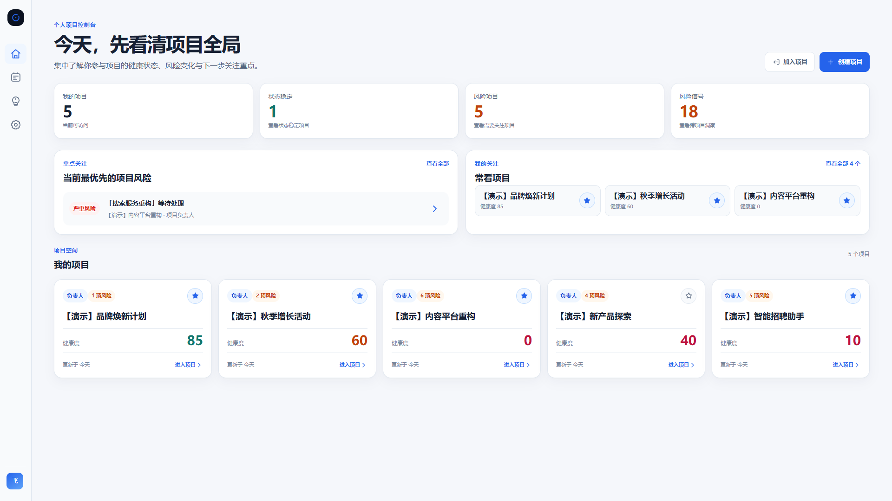
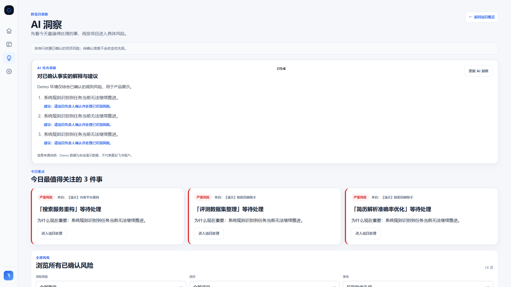
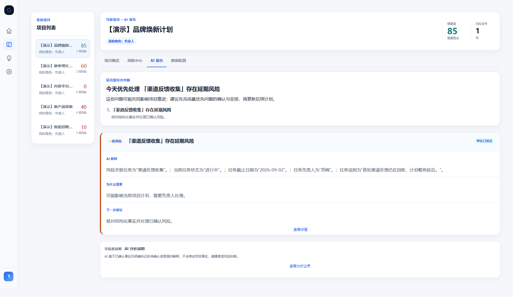
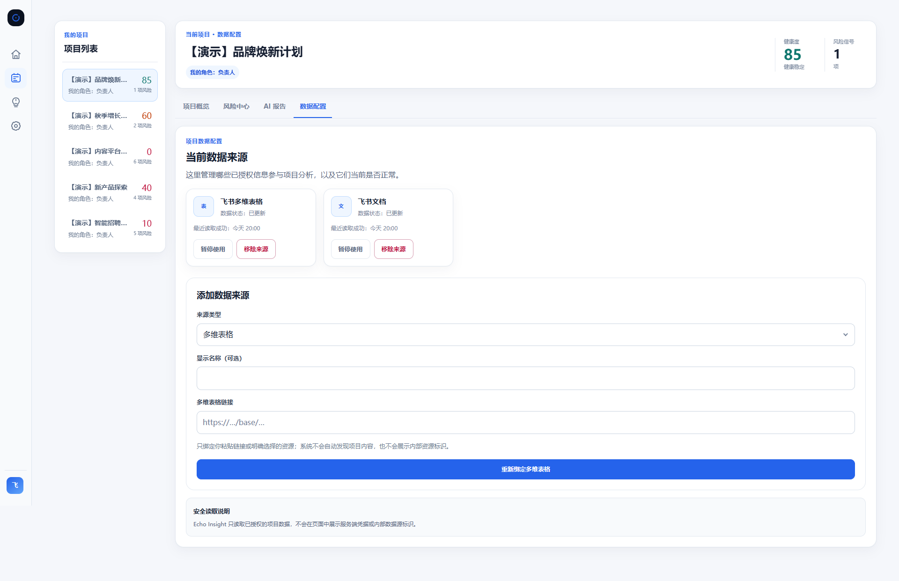
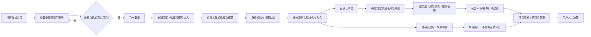
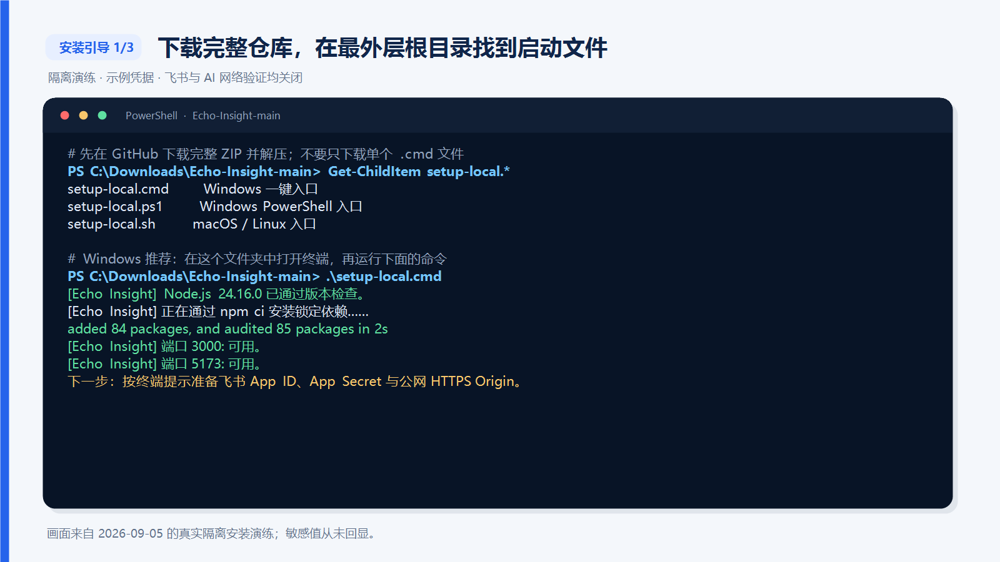
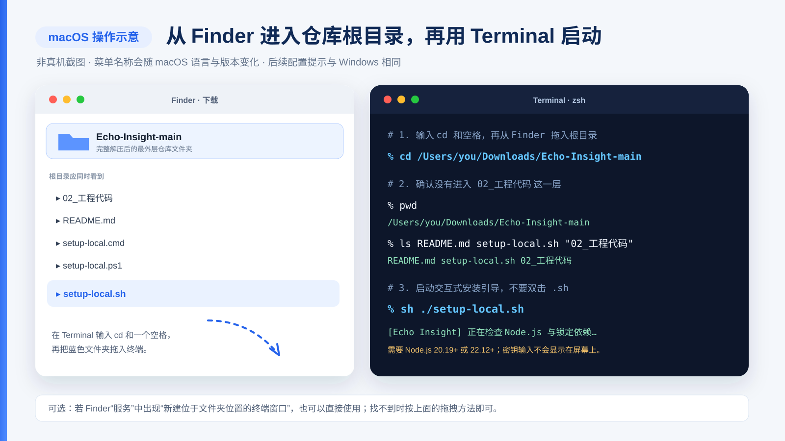
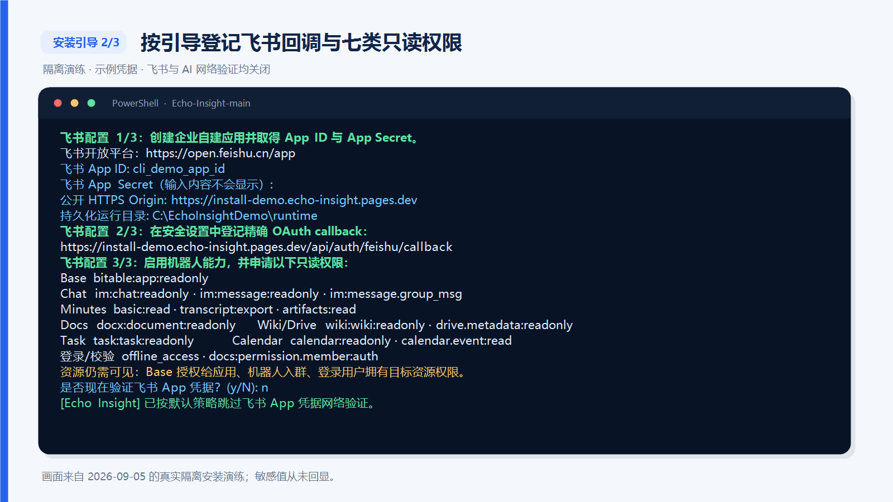
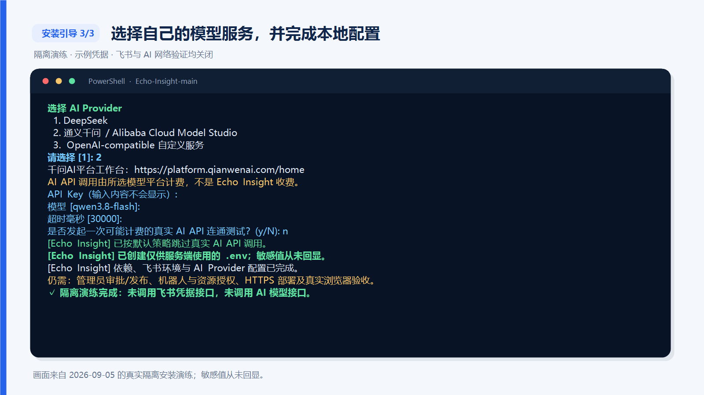

<div align="center">
  
  <h1>Echo Insight · 回响</h1>
  <p><strong>从飞书协作数据中，看清项目健康、风险与下一步。</strong></p>
  <p>一款只读的项目风险观察工具：服务端归一化授权事实，确定性规则计算健康度与风险，AI 解释影响与建议。</p>

  <p>
    <a href="./README.md">简体中文</a> ·
    <a href="./README.en.md">English</a>
  </p>

  <p>
    <a href="./LICENSE"></a>
    <a href="./LICENSE-DOCS.md"></a>
    
  </p>

  <p>
    <a href="https://echo-insight.pages.dev/?mode=demo"><strong>在线体验产品</strong></a> ·
    <a href="./README.md#两种使用方式">使用方式</a> ·
    <a href="./README.md#产品截图">产品截图</a> ·
    <a href="./README.md#一键本地初始化">一键初始化</a> ·
    <a href="./README.md#安装引导">自行部署</a>
  </p>
</div>

---

## Echo Insight 是什么

项目的重要信息往往散落在多维表格、群聊、妙记、文档、任务和日历中。Echo Insight 将用户已经授权、且确实有权访问的飞书数据整理为统一的项目上下文，帮助项目负责人和团队成员快速回答三个问题：

1. 项目现在是否健康？
2. 哪些风险最值得优先关注？
3. 每个判断来自什么事实，下一步可以做什么？

Echo Insight 不是自动执行项目操作的 Agent，也不会替团队修改任务、负责人、Deadline 或文档。它是一张项目雷达：把已确认事实、待确认信息和来源冲突分开呈现，让人基于证据做最终决策。

## 两种使用方式

| 使用路径 | 适合谁 | 入口 | 你需要准备 |
| --- | --- | --- | --- |
| **在线体验产品** | 希望先完整了解产品能力的用户 | [打开 Echo Insight](https://echo-insight.pages.dev/?mode=demo) | 无需登录、无需 API Key；进入包含 5 个不同健康度项目的只读演示账号 |
| **自行部署** | 希望掌控数据、模型与运行环境的团队或开发者 | [从安装引导开始](./README.md#安装引导) | Node.js、飞书自建应用、自己的 AI Provider API Key、HTTPS 与持久化存储 |

### 在线体验产品操作指南

1. 打开 [Echo Insight 在线体验产品](https://echo-insight.pages.dev/?mode=demo)，无需登录即可进入完整的只读演示账号。
2. 从 5 个不同健康度的合成项目中切换，并体验项目概览、风险中心、AI 报告、七类数据来源、跨项目 AI 洞察和设置说明；健康度与风险由正式确定性规则实时计算，AI 解释为预生成示例，页面不会调用外部模型。
3. 需要查看自己的项目时，再点击「登录并使用我的项目」并完成飞书授权。
4. 首次进入真实工作区时，可选择 DeepSeek / 千问并填写自己的 API Key；也可以暂不接入，只使用确定性健康度与风险规则。
5. 新账号若尚未创建或加入任何项目，会看到真实工作区空状态，而不会被授予维护者或其他用户的项目；可随时返回免登录的完整演示账号。

> **免登录演示账号不读取飞书数据，也不会消耗任何人的模型额度。**进入真实工作区后，在线版仍不会把维护者的模型 Key 作为访客兜底。你提交的 Key 会在服务端加密保存，并绑定同一 Echo Insight 部署、同一飞书应用中的账号；它不会写入浏览器存储、项目文件或仓库，也不会通过状态接口返回。同一账号退出后重新登录、会话过期后重登、换设备或后端重启后重登都会自动恢复；不同账号彼此隔离。主动点击「断开并删除已保存的 API Key」才会删除 Echo Insight 保存的记录。未接入模型时，确定性健康度与风险规则仍可使用，但 AI 解释和综合洞察会显示不可用。

模型调用费由 DeepSeek 或千问平台向 Key 所属账户收取，不是由 Echo Insight 收取。点击「连接并验证」会发起一次极小的连通测试；连接后，进入已配置项目、首次打开「AI 洞察」或主动刷新时可能自动调用模型。在线版按飞书应用账号限制为每 10 分钟最多启动 12 次 AI 解释 / 综合任务、同时最多 2 次，连接验证最多 3 次；重新登录或换设备不会重置本次后端进程内的账号限额，Provider 内部重试与最终账单仍以模型平台记录为准。在线入口适合了解产品流程；需要处理长期、详细或敏感项目数据时，推荐[自行部署](./README.md#安装引导)，并在模型平台设置预算与用量告警。

演示账号与真实工作区是两个隔离的数据域。演示账号无需登录且所有写操作均被服务端拒绝；真实工作区必须使用飞书登录，且不代表所有飞书租户或账号都自动拥有使用权限。真实页面可见内容始终受应用可用范围、用户授权和项目权限约束。

## 产品截图



<table>
  <tr>
    <td width="50%" valign="top">
      <strong>跨项目 AI 洞察</strong><br />
      <sub>先聚合已经由规则确认的风险，再解释优先级与建议。</sub><br /><br />
      
    </td>
    <td width="50%" valign="top">
      <strong>项目 AI 报告</strong><br />
      <sub>保留风险事实、规则依据、AI 解释和下一步建议的边界。</sub><br /><br />
      
    </td>
  </tr>
  <tr>
    <td colspan="2" valign="top">
      <strong>显式数据源配置</strong><br />
      <sub>只读取负责人明确选择或粘贴的资源，不自动发现项目内容。</sub><br /><br />
      
    </td>
  </tr>
</table>

> 所有截图均使用合成演示数据，不代表任何真实飞书租户、成员或项目内容。

## 核心能力

| 能力 | 产品表现 |
| --- | --- |
| **多项目总览** | 汇总用户可访问项目的健康度、风险数量、重点事项与常看项目 |
| **七类飞书来源** | 支持 Base、Chat、Minutes、Docs、Wiki/Drive、Task、Calendar |
| **确定性风险规则** | 先基于结构化事实计算健康度、风险等级与命中原因，不让模型重新评分 |
| **项目信息分层** | 区分已确认事实、待确认信号、来源冲突与数据新鲜度；待确认信息不进入正式风险计算 |
| **AI 解释与建议** | 在规则结果之上生成影响说明、优先级和行动建议；模型失败时仍保留已确认的规则结果 |
| **跨项目洞察** | 聚合多个项目的已确认风险，支持按等级与项目筛选，并按风险优先级或计划时间排序 |
| **权限与角色边界** | 登录、资源权限验证和字段裁剪均在服务端完成；负责人管理数据源，成员查看状态 |
| **自带模型选择** | 在线版支持账号级 DeepSeek / 千问官方预设与服务端加密保存；自托管版另支持自定义 OpenAI-compatible Chat Completions 服务 |

## 工作流程



这条链路遵循四个不变原则：权限过滤先于分析；确定性规则先于 AI；AI 不能修改事实或评分；外部模型失败不能被伪装成成功。

<a id="installation-guide"></a>

## 安装引导

如果你第一次从 GitHub 安装项目，请先选择目标，再按下面四步操作。不要只下载某一个 `setup-local` 文件：三个根目录入口还需要仓库中的工程脚本和锁定依赖，必须保留完整目录结构。

| 你的目标 | 是否需要飞书登录 | 是否需要公网 HTTPS | 推荐入口 |
| --- | --- | --- | --- |
| 先看产品 | 否 | 否 | [完整演示账号](https://echo-insight.pages.dev/?mode=demo) |
| 在自己电脑运行虚拟项目 | 否 | 否 | [本机 Demo](./README.md#本机-demo不接真实飞书) |
| 读取自己的真实飞书项目 | 是 | 是 | 先取得稳定 HTTPS 地址（隧道或正式部署），再运行根目录 `setup-local.*` |

> **只有接入真实飞书时才需要准备公网地址。**Echo Insight 当前支持的真实 OAuth / 生产配置要求一个稳定、可从用户浏览器访问的 HTTPS 前端 Origin，格式如 `https://echo.<你的真实域名>`（这是占位格式，不能原样输入）。安装器会根据它生成 OAuth callback，但不会替你购买域名、创建 HTTPS 隧道或完成云端部署；为了保持受支持的安全拓扑，初始化器会拒绝 `localhost`、私网地址和保留域名。纯本机 Demo 不受这项限制。

### 1. 下载完整项目

新手推荐点击 [下载完整项目 ZIP](https://github.com/xixi01010/Echo-Insight/archive/refs/heads/main.zip)，也可以在 GitHub 仓库页面点击 **Code → Download ZIP**。下载完成后先“全部解压”，不要直接在压缩包预览窗口内运行脚本。

熟悉 Git 的用户也可以运行：

```bash
git clone https://github.com/xixi01010/Echo-Insight.git
```

### 2. 找到最外层根目录与启动文件

解压后打开最外层的 `Echo-Insight-main` 文件夹。正确位置应同时看到 `README.md`、`02_工程代码` 和下面三个启动文件；如果只看到 `package.json`、`frontend`、`backend`，说明你已经进入得太深，应返回上一级。

| 系统 | 根目录入口 | 推荐操作 |
| --- | --- | --- |
| Windows | `setup-local.cmd` | 在根目录打开终端，运行 `./setup-local.cmd` |
| Windows PowerShell | `setup-local.ps1` | 在根目录打开 PowerShell，运行 `./setup-local.ps1` |
| macOS / Linux | `setup-local.sh` | 在根目录打开终端，运行 `sh ./setup-local.sh` |

**Windows：**Windows 11 可以在文件夹空白处右键选择“在终端中打开”；其他 Windows 版本可以点击文件夹地址栏、输入 `powershell` 并回车。虽然也可以双击 `setup-local.cmd`，但完成或报错后窗口可能立即关闭，因此更推荐从终端运行。



**macOS：**在 Finder 的“下载”中双击 ZIP 完整解压，再打开“终端”。输入 `cd `（注意末尾空格），把 `Echo-Insight-main` 文件夹从 Finder 拖入终端并按回车。运行 `pwd` 和 `ls README.md setup-local.sh "02_工程代码"` 确认位于根目录，最后运行 `sh ./setup-local.sh`。不要双击 `.sh`：App Secret 与 API Key 的隐藏输入需要真实交互终端。部分 macOS 可在 Finder 的“服务”菜单中使用“新建位于文件夹位置的终端窗口”，但名称会随系统语言与版本变化。



### 3. 按终端提示完成飞书配置

依次提供示例中所列的 App ID、隐藏输入的 App Secret、最终公网 HTTPS Origin 和绝对运行目录。安装器随后会显示精确 callback 与七类来源权限清单；请先在飞书开放平台完成相应设置，再返回终端确认。



### 4. 选择模型服务并完成本地配置

按提示选择 Provider，并隐藏输入你自己的 API Key。飞书凭据验证和 AI 连通测试都默认关闭；只有你主动选择时才会发起真实网络请求。终端显示配置完成后，继续阅读[一键本地初始化详情](./README.md#一键本地初始化)和[完整自托管](./README.md#完整自托管)，完成管理员审批、应用发布与安装、资源授权、HTTPS 部署和真实浏览器验收。



> 三张 PNG 来自 2026-09-05 的 Windows 隔离演练，使用示例凭据，未读取项目真实 `.env`，也未调用飞书凭据接口或 AI 模型接口。macOS 图片是按相同命令制作的操作示意，并非 macOS 真机截图；`setup-local.sh` 已通过静态兼容检查，但在完成 macOS 真机演练前不会宣称完整验收通过。

## 一键本地初始化

根目录提供 Windows、PowerShell 和 macOS / Linux 三个入口。这里的“本地”是指初始化器在你的电脑上运行，不代表真实飞书功能只靠 `localhost` 就能完成。入口会安装锁定依赖，并逐步引导你完成飞书应用、OAuth 回调、运行时目录与 AI Provider 的服务端配置。

### 运行要求

- [Node.js](https://nodejs.org/en/download/) `^20.19.0` 或 `>=22.12.0`，并包含 npm
- Git（仅在选择 `git clone` 获取代码时需要；下载 ZIP 不需要）
- 一个飞书企业自建应用，以及它的 App ID 和 App Secret
- 已确定、可从公网访问的最终 HTTPS 前端 Origin，格式如 `https://echo.<你的真实域名>`（替换占位内容后再输入）
- 你自己的 AI Provider API Key；模型调用费由相应平台收取

### 1. 获取代码

```bash
git clone https://github.com/xixi01010/Echo-Insight.git
cd Echo-Insight
```

### 2. 从根目录运行初始化入口

Windows（推荐在根目录终端运行；也可以直接双击 `setup-local.cmd`）：

```powershell
.\setup-local.cmd
```

Windows PowerShell：

```powershell
.\setup-local.ps1
```

macOS / Linux：

```sh
sh ./setup-local.sh
```

macOS 若不确定当前目录，可先运行：

```sh
pwd
ls README.md setup-local.sh "02_工程代码"
```

初始化器会：

- 检查 Node.js 版本；
- 通过 `npm ci` 安装锁定依赖；
- 检查默认端口 `3000` 与 `5173`；
- 收集 App ID，隐藏输入 App Secret，并根据最终 HTTPS Origin 生成精确 OAuth callback；
- 要求使用绝对路径作为持久化运行目录；
- 展示七类信息来源所需的权限与资源可见性清单，等待你确认飞书后台步骤已经完成；
- 交互选择 DeepSeek、千问或自定义 OpenAI-compatible Provider，并隐藏输入 API Key；
- 自动生成不回显的访客 AI 凭据主密钥，为日后切换到账号级 BYOK 模式预留安全配置；
- 仅在工程目录不存在 `.env` 时，以排他方式创建服务端 `.env`；
- 默认不发起真实网络请求；只有你分别确认时，才验证飞书凭据或发起一次可能计费的模型连通测试。

初始化器不会：

- 读取或覆盖已经存在的 `.env`；检测到该文件时会在安装依赖前停止；
- 代替你创建、发布或安装飞书应用，审批权限或设置应用可用范围；
- 代替你把机器人加入目标群、把目标 Base 授权给应用，或授予用户具体资源访问权；
- 创建公开 HTTPS 地址或验证它确实可以从飞书访问；
- 代替你选择产品中的项目数据源；
- 自动启动前后端；
- 自动创建 Cloudflare、Railway、Docker 或其他云资源。

因此，这个入口是**一键安装与完整配置引导**，不是“一键完成云端部署”。走完引导后，仍必须完成外部平台操作和真实浏览器验收。

### 本机 Demo（不接真实飞书）

如果只是想在自己的电脑运行介绍片虚拟项目，不需要 App ID、App Secret、公网地址或模型 API Key，也不要先运行 `setup-local.*`。安装 Node.js 后，在仓库根目录执行：

```sh
cd "02_工程代码"
npm ci
```

随后打开两个终端，都进入 `02_工程代码`。终端 A 运行：

```sh
npm run demo:backend
```

终端 B 运行：

```sh
npm run dev:frontend
```

浏览器打开 `http://localhost:5173`。这个模式使用专用合成数据和预生成演示解释，不登录飞书、不调用真实模型；关闭终端或电脑后服务即停止。它用于体验和开发，不用于读取真实项目。

### 安装后，产品到底在哪里运行？

Echo Insight 是“浏览器前端 + Node.js 后端”，不是一个由飞书代为运行的本地桌面软件。飞书负责身份授权和数据 API；前端、后端与运行时数据仍由你自己运行。是否必须上云取决于使用目标：

| 运行方式 | 谁能访问 | 真实飞书 OAuth | 服务何时可用 |
| --- | --- | --- | --- |
| `localhost` 本机 Demo / 开发 | 当前电脑的浏览器 | 当前普通开发模式不启用 | 两个终端保持运行时 |
| 本机服务 + 稳定 HTTPS 隧道 | 获得链接、且在应用可用范围内的测试用户 | 可以按当前同源方案配置 | 电脑、前后端与隧道都保持运行时 |
| 正式公网部署 | 应用可用范围内的用户 | 支持，也是长期使用的推荐方式 | 由托管基础设施持续运行 |

因此，**不一定要购买云服务器，但真实飞书登录需要一个稳定 HTTPS 网页入口**。你可以让 HTTPS 隧道把请求转发到自己的电脑，也可以把前端和后端部署到云端；前者适合个人试用和演示，后者适合持续使用。隧道地址一旦改变，飞书后台网页应用首页、重定向 URL、`FRONTEND_ORIGIN` 和 `FEISHU_IDENTITY_REDIRECT_URI` 都必须同步更新。

若 HTTPS 隧道直接转发到 Vite 开发服务，请在隧道中把上游 Host 重写为 `localhost:5173`；否则 Vite 的默认 Host 检查可能拒绝外部域名。不要通过允许任意 Host 来绕过检查。需要长期运行时，应构建前端并通过受控反向代理提供同源 `/api`。

飞书后台对应步骤可参考官方文档：[创建并配置网页应用](https://open.feishu.cn/document/client-docs/h5/development-guide/step1?lang=zh-CN)、[配置重定向 URL](https://open.feishu.cn/document/develop-web-apps/configure-redirect-urls)、[OAuth 授权码流程](https://open.feishu.cn/document/common-capabilities/sso/api/obtain-oauth-code)和[发布应用版本](https://open.feishu.cn/document/client-docs/h5/development-guide/step-4?lang=zh-CN)。Echo Insight 当前的安装器采用比临时调试更收敛的产品边界，只接受公网 HTTPS Origin。

### AI Provider 选择

| Provider | 默认模型 | 初始化时需要提供 | 官方入口 |
| --- | --- | --- | --- |
| **DeepSeek** | `deepseek-v4-flash` | API Key；模型、完整 Endpoint 与超时可调整 | [获取 API Key](https://platform.deepseek.com/api_keys) · [首次调用](https://api-docs.deepseek.com/quick_start/first_request) · [计费](https://api-docs.deepseek.com/quick_start/pricing/) |
| **千问AI平台** | `qwen3.8-flash` | 通用按量付费 API Key；模型与超时可调整，标准 Endpoint 已预设 | [工作台](https://platform.qianwenai.com/home) · [API Key 指引](https://platform.qianwenai.com/docs/api-reference/preparation/api-key) · [计费](https://platform.qianwenai.com/docs/developer-guides/getting-started/pricing) |
| **OpenAI-compatible** | 由你指定 | API Key、完整 `/chat/completions` Endpoint、模型、JSON 模式、Token 字段与超时 | 使用你的服务商文档 |

自定义 Endpoint 必须是完整的 Chat Completions URL。远程地址必须使用 HTTPS；只有本机回环地址允许 HTTP。Endpoint 不能携带用户名、密码、query 或 fragment。

千问预设使用标准按量付费 Key 与 `https://dashscope.aliyuncs.com/compatible-mode/v1/chat/completions`。如果你使用 [Qwen Token Plan](https://platform.qianwenai.com/docs/token-plan/overview)，请选择 OpenAI-compatible，并按官方文档填写 Token Plan 专属 Key 与完整专属 Endpoint。

> 启用 AI 后，经过服务端权限过滤和字段裁剪的结构化项目上下文会发送给你选择的外部 Provider。请在处理敏感项目之前核对该 Provider 的数据保留、隐私、地域与计费条款。

### 模型调用费用

Echo Insight 不收取模型调用费；费用由你选择的 AI 模型平台按照其规则收取。初始化器默认不调用模型，只有你明确同意 AI 连通测试时才会发起一次可能计费的真实请求。

本项目在当前演示规模下实测模型消耗很低，但这不是价格承诺。实际费用会随项目数量、信息来源数量、内容与上下文长度、刷新和报告频率，以及 Provider 的实时价格增加。正式使用前请查看上方官方计费页，并在模型平台设置预算或用量告警。

## 完整自托管

运行初始化器前，请先确定最终公开 HTTPS 前端 Origin；安装器要用它生成飞书后台必须登记的 callback。仓库当前没有 Dockerfile、Compose 或通用云平台模板，因此不会宣称“一键云部署”。

### 1. 配置飞书应用

1. 在[飞书开放平台](https://open.feishu.cn/app)创建企业自建应用，取得 App ID 与 App Secret。
2. 进入**添加应用能力 → 网页应用**，把网页应用首页设置为最终 HTTPS 前端地址。
3. 先部署、保留或通过稳定隧道获得该 HTTPS 地址，再运行根目录初始化器；它会生成 `https://你的前端域名/api/auth/feishu/callback`。
4. 进入**安全设置 → 重定向 URL**，添加初始化器给出的精确 callback；协议、域名、路径和端口必须与实际请求一致。
5. 在权限管理中申请下表权限，配置应用可用范围并完成需要的管理员审批。
6. 进入**应用发布 → 版本管理与发布**创建版本，确认网页应用为默认能力后发布并安装到目标租户。
7. 按来源补齐机器人入群、Base 应用访问权和用户资源访问权。

[飞书权限列表](https://open.feishu.cn/document/ukTMukTMukTM/uYTM5UjL2ETO14iNxkTN/scope-list)可以按下列权限代码搜索。表中既包含用户 OAuth scope，也包含应用 / 机器人身份访问所需权限；它们不是一组可以忽略身份差异的通用权限。

| 用途 / 来源 | 当前代码所需权限 | 身份与资源条件 |
| --- | --- | --- |
| 登录与续期 | `offline_access` | 登录用户完成 OAuth 授权 |
| Base | `bitable:app:readonly` | 使用应用身份；目标 Base 还必须允许该应用读取 |
| Chat | `im:chat:readonly`、`im:message:readonly`、`im:message.group_msg` | 用户 OAuth 使用前两项完成群列表 / 成员关系相关校验；应用 / 机器人身份使用消息权限读取历史，群历史还需 `im:message.group_msg`，并且必须启用机器人、让它进入且可访问目标群 |
| Minutes | `minutes:minutes.basic:read`、`minutes:minutes.transcript:export`、`minutes:minutes.artifacts:read` | 登录用户必须能访问目标妙记 |
| Docs | `docx:document:readonly` | 登录用户必须能访问目标文档 |
| Wiki / Drive | `wiki:wiki:readonly`、`drive:drive.metadata:readonly` | 登录用户必须能访问目标知识库或云盘资源 |
| Task | `task:task:readonly` | 登录用户必须能访问目标任务 |
| Calendar | `calendar:calendar:readonly`、`calendar:calendar.event:read` | 登录用户必须能访问目标日历与事件 |
| 通过 Base 链接加入项目时的权限校验 | `docs:permission.member:auth` | 单独确认用户对该 Base 的查看权限；不属于普通登录 scope，也不是第八类信息来源 |

仅“申请权限”并不等于已经可用：权限可能还需管理员批准、随应用版本发布并安装；用户必须完成 OAuth 授权，并且表中对应的调用身份必须对具体资源可见。初始化器会展示这张清单并等待确认，但无法替你操作飞书后台。

Chat 历史的实际范围还可能受机器人入群时间、群历史可见设置、保密模式和应用可用范围限制；权限代码齐全不代表一定能读取全部历史。

### 2. 补齐各运行环境的配置

初始化器会在工程根目录新建服务端 `.env`，写入生产模式、飞书 App 凭据、前端 Origin、精确 callback、绝对运行目录和所选 AI Provider。它不会读取或覆盖已有 `.env`。请参考 [`02_工程代码/.env.example`](./02_工程代码/.env.example)，分别配置以下三类环境；不要把它们混在同一个前端构建文件中。

**后端运行时变量**

| 变量 | 用途 |
| --- | --- |
| `NODE_ENV=production` | 启用生产身份与运行时安全边界 |
| `FEISHU_APP_ID` / `FEISHU_APP_SECRET` | 飞书服务端应用凭据 |
| `FEISHU_IDENTITY_REDIRECT_URI` | 飞书后台登记的精确 OAuth callback URL |
| `FRONTEND_ORIGIN` | 允许的前端 Origin，也是登录完成后的返回地址 |
| `ECHO_INSIGHT_RUNTIME_DIR` | 可写、持久且为绝对路径的运行时目录 |
| `RAILWAY_VOLUME_MOUNT_PATH` | 使用 Railway Volume 时可替代上一项 |
| `ECHO_INSIGHT_AI_ACCESS_MODE` | `visitor` 让登录用户接入自己的模型 Key；`server` 使用部署者配置的 Provider；未设置时安全缺省为 `visitor` |
| `ECHO_INSIGHT_USER_AI_CREDENTIAL_MASTER_KEY` | `visitor` 模式必填：稳定的 32 字节 Base64 主密钥，只能保存在服务端 Secret / `.env`，不得复用飞书 App Secret |

生产环境必须为运行时目录提供持久、可写的绝对路径。

**前端构建变量**

| 变量 | 用途 |
| --- | --- |
| `VITE_API_BASE_URL` | 前端直连后端时的公开构建期 API 地址；使用同源 `/api` 代理时留空 |

Vite 的项目根目录是 `02_工程代码/frontend`，因此工程根目录的服务端 `.env` 不会被前端构建自动读取。请通过构建平台设置 `VITE_API_BASE_URL`，或将它放入 `02_工程代码/frontend/.env.production` 等 Vite 环境文件；不要在这里放任何密钥。

**静态托管平台的服务端绑定**

| 变量 | 用途 |
| --- | --- |
| `BACKEND_ORIGIN` | 仓库内 Cloudflare Pages Function 使用的后端 Origin |

不要把 `.env`、API Key、App Secret、Token 或 OAuth code 提交到 Git，也不要将它们放入任何前端构建变量。在共享主机上还应限制工程目录与 `.env` 的操作系统访问权限；Windows 会继承父目录 ACL，不能只依赖 POSIX 文件模式。

### 3. 连接前后端

当前正式支持并推荐使用同源 `/api` 代理，这样浏览器会话与 OAuth callback 都停留在前端域名：

- 构建前端时将 `VITE_API_BASE_URL` 留空；
- 部署仓库内的 `02_工程代码/functions/api/[[path]].ts`；
- 在静态托管环境中设置服务端变量 `BACKEND_ORIGIN=https://<你的真实后端域名>`；
- 将 `FEISHU_IDENTITY_REDIRECT_URI` 设为 `https://<你的真实前端域名>/api/auth/feishu/callback`。

前端直连后端属于高级部署方式：此时 `FEISHU_IDENTITY_REDIRECT_URI` 应改为后端 Origin 加 `/api/auth/feishu/callback`。当前会话 Cookie 固定使用 `HttpOnly`、`Secure` 与 `SameSite=Lax`，因此前后端位于无关跨站域名时并非通用支持场景，单独配置 CORS 也不足以解决会话问题。只应在满足 same-site Cookie 条件并完成真实浏览器验证时使用；真正的跨站部署需要调整 Cookie / Session 策略并重新进行安全评审。

### 4. 构建与启动

进入工程目录：

```bash
cd 02_工程代码
```

普通开发模式不会启用真实飞书 OAuth。若只做本地界面与接口调试，请至少在工程根目录的 `.env` 中配置 `ECHO_INSIGHT_DEV_USER_ID`，并按 `.env.example` 决定是否配置开发数据源和种子项目；真实飞书登录应使用上方生产配置与同源 HTTPS 部署。

开发调试时，分别在两个终端运行：

```bash
npm run start:backend
npm run dev:frontend
```

生产构建与后端启动：

```bash
npm run build:frontend
npm run start:backend
```

前端产物位于 `02_工程代码/frontend/dist/`，应由静态站点服务发布；后端默认监听 `3000` 端口。

当前 `npm run start:backend` 通过开发依赖 `tsx` 直接运行 TypeScript，仓库尚未提供编译后的独立后端产物。因此源码部署必须安装完整依赖，不要使用 `npm ci --omit=dev`。

### 5. 部署前验证

```bash
npm test
npm run typecheck
npm run build:frontend
```

完成安装器不等于部署验收通过。还必须在真实浏览器中验证：飞书登录与回调、创建和加入项目的权限、Base、Chat、Minutes、Docs、Wiki / Drive、Task、Calendar 七类来源逐类读取、机器人群权限、刷新与部分失败状态、退出登录，以及桌面端和移动端布局。

## 架构概览

```text
React + Vite Web App
        │
        │ same-origin /api proxy or configured API origin
        ▼
Node.js Backend
  ├─ Feishu OAuth & server-side sessions
  ├─ Project / membership / data-source boundaries
  ├─ Seven-source readers and normalized project context
  ├─ Deterministic health & risk rules
  └─ AI explanation and cross-project synthesis
        │
        ├─ Feishu Open Platform APIs
        ├─ DeepSeek / Qwen / OpenAI-compatible Provider
        └─ Persistent projects.json + data-sources.json + encrypted visitor-ai-accounts.json
```

## 安全、隐私与产品边界

- **只读优先**：默认产品路径不写回飞书，不创建、更新或删除用户项目数据。
- **最小授权**：只读取用户已授权、实际有权访问且由负责人显式选择的资源。
- **权限先于 AI**：身份校验、权限过滤和字段裁剪均发生在规则分析与模型调用之前。
- **规则先于 AI**：健康分数、风险等级和命中原因来自确定性规则；AI 只能解释。
- **不确定性可见**：待确认信息和来源冲突单独展示，不会自动进入健康度或正式风险。
- **密钥只在服务端**：`.env`、飞书凭据和模型 API Key 不得进入前端、日志或仓库。
- **在线访客 Key 按账号隔离**：在线版用飞书应用内的稳定身份索引访客配置，以 AES-256-GCM 在后端持久目录加密保存；索引不明文写入 `open_id`，API 不返回 Key，也不使用维护者 Key 兜底。退出登录只清理当前 Session；主动断开会删除账号记录并立即清除该账号全部活跃 Session 的 Provider。
- **断开不撤回已发送的请求**：主动断开会阻止该账号发起后续模型任务，但已经发送到第三方模型平台的在途请求可能仍会完成并由平台计费；怀疑 Key 泄露时还应在模型平台撤销或轮换它。
- **失败必须诚实**：外部来源或模型失败时保留明确的部分状态，不用缓存或模拟输出伪装成功。
- **不评价员工**：产品不生成员工绩效、能力或态度结论。

## 当前部署边界

当前公开版本更适合单后端实例与受控团队部署：

- 飞书 Session 仍使用进程内存保存，有效期 8 小时；退出登录、会话过期或后端重启后需要重新登录，但同一部署、同一飞书应用中的账号会从加密记录自动恢复模型连接，无需重新输入 Key。
- 项目、数据源注册表与加密访客 AI 账号记录使用本地 JSON 文件，生产环境必须挂载持久、可写的绝对目录。访客模式还必须设置独立的 32 字节 Base64 主密钥 `ECHO_INSIGHT_USER_AI_CREDENTIAL_MASTER_KEY`；该值只放在部署 Secret / 服务端 `.env`，不能提交。
- 为减少重复读取，常规请求可能在最多 120 秒内复用同一份项目分析结果；核对数据新鲜度时应使用产品刷新流程并观察刷新状态。
- 当前不提供分布式 Session、数据库迁移或多实例一致性方案；账号级加密 JSON 仅支持单后端实例。主密钥必须稳定保管，当前版本不支持自动轮换。丢失或直接替换主密钥会使既有加密记录不可读取；无迁移轮换时，必须先让所有用户在旧密钥仍有效时主动断开并确认记录为空，停服后删除或重建空的 `visitor-ai-accounts.json`，再设置新密钥并启动、由用户重新连接。
- `npm run start:backend` 依赖 `tsx` 开发依赖；源码部署需要安装完整依赖，当前没有编译后的独立后端产物。
- 当前不是已发布的 npm 包，需要从源码安装。

如果你的目标是多实例、高可用或大规模生产部署，应先将 Session 和 JSON 存储替换为共享的持久化服务，再进行容量与安全评审。

## 项目结构

```text
.
├─ README.md / README.en.md       # 产品入口与双语使用指南
├─ setup-local.*                  # 根目录一键初始化入口
├─ 00_项目控制台/                 # 公开项目边界与开发规范
├─ 01_项目文档/                   # 仅三份明确列出的公开文档
└─ 02_工程代码/
   ├─ frontend/                   # React + Vite Web App
   ├─ backend/                    # Node.js API、身份、项目与规则编排
   ├─ feishu-connector/           # 飞书多来源只读访问
   ├─ ai-service/                 # Provider、输出协议与安全降级
   ├─ functions/                  # 同源 /api 代理
   ├─ scripts/                    # 初始化、测试与受控验证脚本
   └─ tests/                      # 自动化测试
```

## 公开文档

- [公开文档导航](<./01_项目文档/Echo Insight项目文档导航索引.md>)
- [项目健康评分规则引擎设计](<./01_项目文档/02_技术设计/04_风险规则引擎/项目健康评分规则引擎设计.md>)
- [AI 输出协议 V2 设计](<./01_项目文档/02_技术设计/05_AI架构与输出协议/AI输出协议V2设计.md>)

只有上方列出的三个精确路径属于公开项目文档范围。

## 常见问题

<details>
  <summary>在线体验会消耗维护者的模型 Token 吗？</summary>

不会。无需登录的公开演示只使用合成数据和固定解释，不发起模型调用。进入真实工作区后，在线版生产默认仍禁用部署者 Key 兜底；访客未接入自己的 DeepSeek / 千问 API Key 时，只保留确定性规则结果。接入后产生的模型费用记在该访客自己的模型平台账户中，Key 按飞书应用账号在服务端加密保存；同一账号可跨登录与设备恢复，不会提供给其他账号。

</details>

<details>
  <summary>为什么初始化完成后还不能直接登录？</summary>

根目录脚本会收集并写入飞书与模型的服务端配置，也会给出 callback 和权限清单；但它不能代替你创建、审批、发布和安装飞书应用，不能完成机器人入群或具体资源授权，也不会创建公网 HTTPS 部署。完成这些外部步骤并通过真实浏览器验收后，才算可用。

</details>

<details>
  <summary>初始化器会调用模型并产生费用吗？</summary>

默认不会。只有你明确同意 AI 连通测试时，初始化器才会发起一次可能计费的请求。费用支付给你选择的模型平台，不是 Echo Insight；当前演示规模实测消耗很低，但实际费用会随项目、来源、上下文和使用频率增加。

</details>

<details>
  <summary>可以接入其他模型服务吗？</summary>

可以。选择 OpenAI-compatible，提供完整的 `/chat/completions` Endpoint、模型名和你自己的 API Key；服务还需满足本项目的 JSON 输出与 Endpoint 安全约束。

</details>

<details>
  <summary>AI 会改变项目健康度或写回飞书吗？</summary>

不会。健康度与风险等级由确定性规则计算；AI 只生成解释与建议。默认产品路径不写回飞书。

</details>

## 参与项目

欢迎通过 [Issues](https://github.com/xixi01010/Echo-Insight/issues) 报告普通的可复现问题或提出产品建议，也欢迎提交范围清晰、带验证说明的 Pull Request。安全漏洞不得提交到公开 Issue。维护者必须在仓库公开前启用 GitHub Private Vulnerability Reporting；启用后，请通过 **Security → Report a vulnerability** 私密提交。若该入口尚不可见，请勿公开披露漏洞细节。请勿在 Issue、日志、截图或测试数据中提交真实凭据与租户信息。

## 许可与声明

- `02_工程代码/` 中的原创代码、测试、源码级配置、开发者文档，以及根目录初始化脚本，按 [`LICENSE`](./LICENSE) 所列范围使用 MIT License。
- 三份明确列出的公开项目文档按 [`LICENSE-DOCS.md`](./LICENSE-DOCS.md) 所列范围使用 CC BY 4.0。
- 第三方依赖继续适用各自条款，详见 [`THIRD_PARTY_NOTICES.md`](./THIRD_PARTY_NOTICES.md)。
- Echo Insight / 回响名称与 Logo 的使用边界见 [`TRADEMARKS.md`](./TRADEMARKS.md)。
- 根目录双语 README 与产品截图不在上述 MIT 或 CC BY 4.0 授权范围内，仅用于本项目说明与展示。

许可仅适用于对应文件中明确列出的范围，并不表示仓库内所有内容均自动采用 MIT 或 CC BY 4.0。
